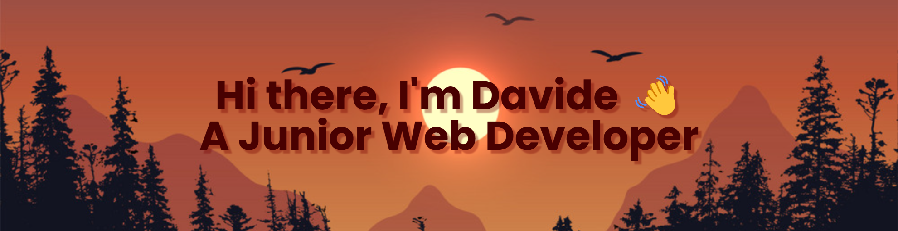

 

## About me:

A Junior Web Developer initiating a career in this exciting field. 
 
This journey started by attending the ironhack Web Development bootcamp where I completed my first projects, and was able to get lots of hands-on experience. 
That was when my interest in the area became a passion!
 
At the moment I am familiar with HTML, CSS, JavaScript, and React, but I am continuously working on other challenges to continue to improve my skills and learn more everyday.
 
I understand the importance of creating accessible, responsive, and cross-browser compatible websites, and I work hard to incorporate modern best practices into my projects.
 
Despite being methodic, I consider myself to be open-minded and flexible, which I believe to be a critical asset for a developer.
 
I am excited to take on new challenges and contribute to projects that make a positive impact!

## My Projects:

- [Acheronte River](https://19davide91.github.io/Game-Acheronte-River/) --> A game where you have to collect souls and avoid demons using the arrow keys on the keyboard.
- [Give Gift](https://gift-app.cyclic.app/) --> An app where you can add friends and give them gifts after creating them too.
- [Pranklicious](https://pranklicious.netlify.app) --> An app to create, comment and share detailed pranks with your friends.

## Languages and Tools:

 

 

<!-- ## 📈 My GitHub Stats:
 

 -->

 

  
<h3>Statistics</h3>

        

          
           
       

      
     </samp>
  
    

  

<h2><i>Contact me:</i></h2>

  
   
   
  My Email: davidelopresti0129@gmail.com

<!--
**19davide91/19davide91** is a ✨ _special_ ✨ repository because its `README.md` (this file) appears on your GitHub profile.

Here are some ideas to get you started:

- 🔭 I’m currently working on ...
- 🌱 I’m currently learning ...
- 👯 I’m looking to collaborate on ...
- 🤔 I’m looking for help with ...
- 💬 Ask me about ...
- 📫 How to reach me: ...
- 😄 Pronouns: ...
- ⚡ Fun fact: ...
-->
